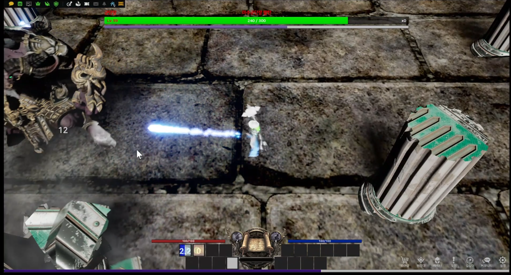
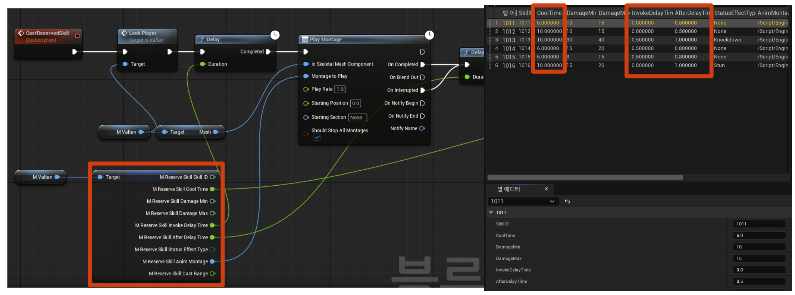

# LostGPU — 블루프린트 100%로 구현한 3D 액션 RPG (UE, Blueprint, Chaos Destructure)

> 빠른 프로토타이핑 역량을 증명하기 위해 100% 블루프린트로 완성한 3D 액션 RPG

### 💡 프로젝트 탐색 가이드

이 README는 프로젝트의 핵심을 요약한 '쇼케이스'입니다. 전체적인 개요를 파악하고, 상위 문서인 프로젝트 갤러리에서 다른 프로젝트들도 확인해 보세요.

| 문서 | 역할 | 내용 |
| :--- | :--- | :--- |
| 📋 [Project Gallery]([https://github.com/chungheonLee0325](https://github.com/chungheonLee0325#-%EC%A3%BC%EC%9A%94-%ED%94%84%EB%A1%9C%EC%A0%9D%ED%8A%B8-main-projects)) | Root (전체 개요) | 모든 프로젝트 목록, 핵심 역량 요약 |
| 📁 **Repository README** | **What & Why (개요)** | 프로젝트 목표, 데모 영상, 핵심 기능, 아키텍처 |

<a href="https://github.com/chungheonLee0325#-%EC%A3%BC%EC%9A%94-%ED%94%84%EB%A1%9C%EC%A0%9D%ED%8A%B8-main-projects"><strong>📋 프로젝트 갤러리</strong></a>
  ❖  
<a href="#-주요-기능-key-features"><strong>📁 README (현재 페이지)</strong></a>

## ▶️ 데모 영상 (Gameplay Demo)
 

 
 

 

 <a href="https://youtu.be/mgP-u5mvh1c"><b>▶ YouTube에서 고화질로 시청하기</b></a>
 

## ✨ 프로젝트 개요 (Overview)
언리얼 엔진 학습 초기 단계에서 C++의 깊은 학습에 앞서, 엔진 자체 기능에 대한 숙련도와 아이디어를 빠르게 구현하는 능력을 검증하고자 했습니다. 이를 위해 C++ 코드 없이 100% 블루프린트만을 사용하고, Sequencer와 Chaos Destruction 같은 내장 기능을 적극 활용하여 '레이드 전투'라는 하나의 완전한 콘텐츠 사이클을 구현하는 데 집중했습니다. 이 프로젝트는 새로운 툴에 대한 빠른 적응력과 아이디어를 신속하게 시각적인 결과물로 만드는 실행력을 보여줍니다.

## 🚀 주요 기능 (Key Features)

### 1. 플레이어 시스템
* **FSM 기반 상태 관리:** 스킬 사용, 피격, 대쉬 등 플레이어의 여러 상태를 FSM으로 관리하여, 스킬 시전 중 다른 스킬 사용을 제한하고 대쉬를 통한 스킬 캔슬이 가능하도록 구현했습니다.
* **상태 이상 시스템:** 보스의 공격에 의해 스턴, 넘어짐 등 상태 이상에 걸릴 수 있으며, 해당 상태에서는 이동 및 공격이 제한되고 시전중인 스킬을 캔슬합니다.

### 2. 보스 시스템 (발탄)
* **FSM 기반 AI:** FSM을 통해 보스의 행동 패턴(대기, 추적, 공격)을 제어했습니다.
* **스킬 룰렛 시스템:** 확률과 사정거리를 기반으로 다양한 스킬 패턴을 동적으로 선택하여 사용하여 예측 불가능한 전투 경험을 제공합니다.

### 3. 언리얼 엔진 기능을 활용한 완성도 높은 연출
* **완성형 레이드 루프:** 보스 선택부터 전투, 승패 판정까지 이어지는 하나의 완전한 콘텐츠 사이클을 완성했습니다.
* **시네마틱 컷신:** 언리얼 엔진의 **시퀀서(Sequencer)** 기능을 활용하여 보스룸 입장 시 재생되는 동적인 등장 컷신을 구현하여 전투의 몰입감을 높였습니다.
* **지형 파괴:** 언리얼 엔진의 카오스 디스트럭션(Chaos Destruction) 기능을 활용하여 보스의 특정 패턴 시전 시 지형이 파괴되는 역동적인 연출을 구현했습니다.
* **갑옷 파괴 시스템:**
    * 보스의 갑옷을 본체와 분리된 **별도의 스켈레탈 메시 컴포넌트**로 구성했습니다.
    * 평상시에는 **'Set Leader Pose Component'** 기능을 사용하여 갑옷 메시가 본체의 움직임과 애니메이션을 완벽하게 따라 하도록 만들었습니다.
    * 플레이어의 특정 스킬이 누적되어 **파괴 스택**이 가득 차면, 따라다니던 갑옷 컴포넌트만 숨기거나 파괴하여 실제 갑옷이 부서져 사라지는 연출을 구현했습니다.

### 4. 확장성을 고려한 데이터 주도 설계

📊 **스킬 데이터 테이블 구조**

* **공용 스킬 시스템:** 플레이어와 보스가 상속받아 사용하는 `Base Skill Class`를 설계하여 재사용성을 높였습니다.
* **데이터 테이블 활용:** 스킬의 데미지, 쿨타임, 사거리, 효과(즉발형/장판형/시전형) 등 모든 정보를 데이터 테이블로 분리하여, 코드 수정 없이 신규 스킬 추가 및 밸런스 조정이 용이한 유연한 구조를 구축했습니다.

